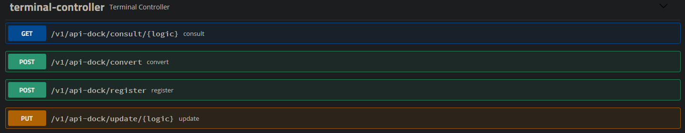

<h1 align="center">api-dock</h1>

## Objetivo

O Objetivo desta api é poder realizar o cadastro, alteração e conversão das informações realizadas através das requisições.

## Tecnologia
  - Java 8+
  - Gradle
  - H2
  - Junit
  - Spring Test
  - Swagger2
  - Tomcat
  - REST
  - MVC
  

## Endpoints

A API possui 4 endpoints:

- /consult

> Responsavel por realizar a consulta de algum Terminal Cadastrado.

- /convert
> Responsavel por converter o text recebido em uma mensagem no formato JSON.

- /register
> Responsavel por cadastrar um novo Terminal desejado.

- /update
> Responsavel por realizar o update de algum termina que já foi cadastrado.
